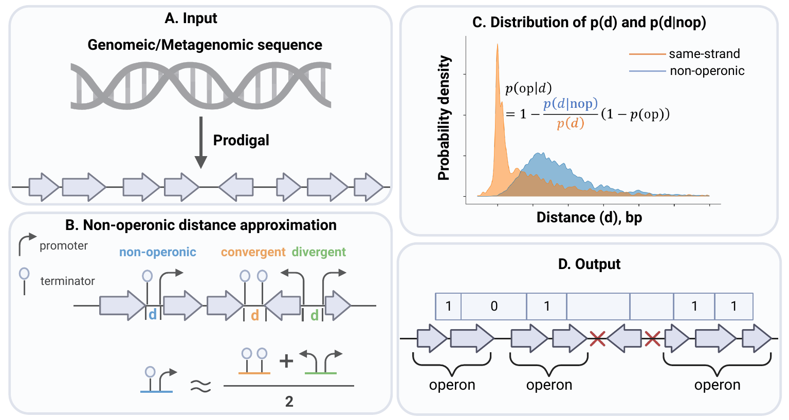

# UniOP: Universal operon prediction for high-throughput prokaryotic (meta-)genomics data using intergenic distanace
```
UniOP was implemented in Python 3.11.5 and runs on MacOS and Linux systems.
```

## Overview
**UniOP** is a fast and accurate computational method for operon prediction, independent of experimental or functional information. It takes as input prokaryotic genomes or metagenome-assembled genomes (MAGs).


## How to use UniOP
### Dependencies
**UniOP** requires:
```
* Python (The results in the paper were obtained by 3.11.5)
* Python libraries: argparse, pandas, numpy, scikit-learn, datetime
* Prodigal [conda install -c bioconda prodigal]
```
The starting point should be either a FASTA file of the nucleotide genome sequence (`.fna`) or protein-coding sequences (**CDS**) (`.faa`). This is typically achieved by running a gene prediction program such as [Prodigal](https://github.com/hyattpd/Prodigal).

### Quickstart
```
git clone https://github.com/hongsua/UniOP.git
cd UniOP/src
python UniOP -a ../demo/GCF_000005845.2.faa
```
Note: Install **Prodigal** into the working directory, ~/UniOP/src, is necessary.

This will output files **uniop.pred** and **uniop.operon** into the same path (../demo/) as the input file by default. You can also specify a folder with the command:
```
python UniOP -i ../demo/GCF_000005845.2.fna -t your_folder
```
If the input file is the nucleotide genomic sequence, you will get the following files: **GCF_000005845.2.faa**, **GCF_000005845.2.gff** as well.

```
python UniOP -i ../demo/GCF_000005845.2.fna
```
You can type:
```
python UniOP --help
```
to find all parameters in UniOP.


## Support
If you have questions or found any bug in the program, please write to us at
hong.su[at]mpinat.mpg.de
