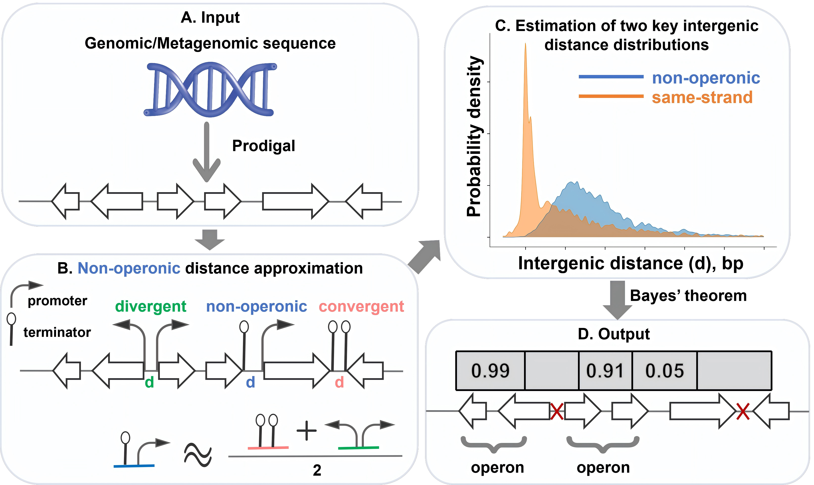

# UniOP: Universal operon prediction for high-throughput prokaryotic (meta-)genomics data
```
UniOP was implemented in Python 3.11.5 and runs on MacOS or Linux systems.
```

## Overview
Operon prediction remains challenging for poorly characterized prokaryotic genomes, particularly for metagenome-assembled genomes (MAGs) that lack functional annotations and evolutionary relatives. Existing methods typically rely on supervised training, comparative genomics, or external databases, limiting their applicability to such data.

**UniOP** address this gap by inferring operon structure directly from intergenic distance distributions within the target genome. It requires no external information, no training data, and no species-specific assumptions. 

UniOP takes as input either a nucleotide genome sequence (FASTA), a protein sequence file (FAA), or a gene annotation file (GFF), and outputs pairwise operon probabilities and assembled operon units. The tool is implemented in Python and runs on macOS or Linux systems.



## How to use UniOP
### Dependencies
**UniOP** requires the following:
```
* Python (version 3.11.5 recommended; the results in the paper were obtained with this version)
* Python libraries: argparse, pandas, numpy, scikit-learn, datetime
* Prodigal (required only when using nucleotide FASTA as input)

You can install Prodigal via:

conda install -c bioconda prodigal
```

### Quickstart
Clone the repository and run UniOP on the provided demo data.

```
git clone https://github.com/hongsua/UniOP.git
cd UniOP/src
```

#### Using a genomic sequence (auto-runs Prodigal)
```
python UniOP -i ../demo/GCF_000005845.2.fna --bin_dir /path/to/prodigal
```

#### Using a FAA file
```
python UniOP -a ../demo/GCF_000005845.2.faa --faa_source prodigal_faa   # for Prodigal FAA
python UniOP -a ../demo/GCF_000005845.2.faa --faa_source ncbi_faa   # for NCBI FAA
```

#### Using a GFF file
```
python UniOP -f ../demo/GCF_000005845.2.gff --gff_source prodigal_gff   # for Prodigal GFF
python UniOP -f ../demo/GCF_000005845.2.gff --gff_source ncbi_fgff   # for NCBI GFF
```

> **Note**: If you use the `-i` option, Prodigal must be installed and accessible via `--bin_dir`.

This will output:
- `uniop.pred`  -pairwise operon probabilities for all adjacent same-strand gene pairs.
- `uniop.operon` -assembled operon units (if not disabled with `--no_operon_assembly`)

By default, output files are written to the same directory as the input file. You can specify an output folder with `-t`:

```
python UniOP -i ../demo/GCF_000005845.2.fna -t ./results --bin_dir /path/to/prodigal
```

### Supported input formats

| Input type                | Option | Required argument                  | Example command |
|---------------------------|--------|------------------------------------|-----------------|
| Genomic sequence (FNA)    | `-i`   | `--bin_dir` (if not in PATH)       | `python UniOP.py -i genome.fna --bin_dir /usr/bin` |
| Prodigal FAA              | `-a`   | `--faa_source prodigal_faa`        | `python UniOP.py -a genes.faa --faa_source prodigal_faa` |
| NCBI FAA                  | `-a`   | `--faa_source ncbi_faa`            | `python UniOP.py -a genes.faa --faa_source ncbi_faa` |
| Prodigal GFF              | `-f`   | `--gff_source prodigal_gff`        | `python UniOP.py -f genes.gff --gff_source prodigal_gff` |
| NCBI GFF                  | `-f`   | `--gff_source ncbi_gff`            | `python UniOP.py -f genes.gff --gff_source ncbi_gff` |


### Full parameter list
```
python UniOP --help
```

### Citation
If you use UniOP in your research, please cite the preprint:
> Su, H., Zhang, R., & Söding, J. (2024). UniOP: a universal operon prediction for high-throughput prokaryotic (meta-) genomic data using intergenic distance. *bioRxiv*, 2024-11.

We will update the official citation once the manuscript is published.

### Support
If you have questions, encounter any bugs, or need help applying UniOP to your data, please open an issue on GitHub or contact us directly:
- GitHub Issues: [https://github.com/hongsua/UniOP/issues](https://github.com/hongsua/UniOP/issues)
- hong.su[at]nankai.edu.cn

We welcome feedback, feature requests, and community contributions.
