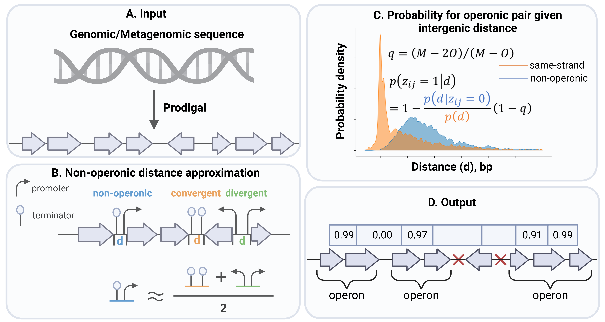

# UniOP: unsupervised single-sequence operon prediction for all prokaryotic (meta-)genomics data
```
UniOP is implemented in Python3 and runs on MacOS and Linux systems.
```

## Overview
**UniOP** is a fast and accurate computational method for operon prediction, independent of experimental or functional information. It takes as input prokaryotic genomes or metagenomic assembled genomes (MAGs).


## Installation
### Dependencies
**UniOP** requires:
```
* Python (>=3.11)
* Python libaries: argparse, pandas, numpy, scikit-learn, datetime
* Prodigal [conda install -c bioconda prodigal]
```
The starting point should be either a FASTA file of the nucleotide genome sequence (`.fna`) or protein-coding sequences (**CDS**) (`.faa`). This is typically achieved by running a gene prediction program such as [Prodigal](https://github.com/hyattpd/Prodigal).

### Quickstart
```
git clone https://github.com/hongsua/UniOP.git
cd UniOP/src
python UniOP.py -i ../demo/GCF_000005845.2.fna
```
Install **Prodigal** into the working directory, ~/UniOP/src.

This will output gene predictions into the same path as the input file, resulting in the following output files: **GCF_000005845.2.faa**, **GCF_000005845.2.gff**, and the operon prediction file named **uniop.pred**.


## Support
If you have questions or found any bug in the program, please write to us at
hong.su[at]mpinat.mpg.de
